# E12: Trigram Delta-Coding Pipeline for Activation Compression in Pipeline Parallelism

> **Model**: Qwen2.5-32B-Instruct (32B parameters, hidden\_dim = 5120)
> **Layer boundary**: Layer 6 (first 6 transformer layers on PP stage 0)
> **Evaluation**: 7 datasets × 2 context lengths (512, 2048) — 50 warmup + 50 test requests per combination
> **Hardware**: 8 × NVIDIA A800-SXM4-80GB

---

## 1. Introduction & Motivation

In pipeline-parallel (PP) serving of large language models, intermediate activations must be transferred between pipeline stages at every micro-batch boundary. For a 32B-parameter model at layer 6 with hidden\_dim = 5120, a single request of 2048 tokens requires transferring **20 MB** of FP16 data. When PP stages reside on different nodes connected by bandwidth-constrained links (200 Mbps–1 Gbps), this transfer becomes a significant bottleneck.

We propose a **trigram delta-coding pipeline** that exploits the observation that n-gram token patterns repeat across requests. By maintaining a persistent DAG trie of previously computed activations keyed by token trigrams, we can represent most positions as small deltas against cached references, achieving **2.5–3.0× compression** with **< 0.04% cosine loss**.

---

## 2. System Design

### 2.1 Architecture Overview

```
┌────────────────────────────────────────────────────────────────┐
│  Sender (PP Stage 0)                                          │
│                                                                │
│  ① Prefill (GPU)  ─────────────────┐                          │
│  ② Classify (CPU, overlapped w/ ①)  │  concurrent              │
│  ③ Encode per tier (GPU):           │                          │
│     • Trigram/Bigram → Affine + Int4 delta + Top-K sparsity   │
│     • Self-ref → delta vs. reconstructed earlier position     │
│     • Unigram → Int8 groupwise + outlier Top-K                │
│  ④ Table update (CPU, overlapped w/ ③)                        │
└────────────────────────────────────────────────────────────────┘
      │ compressed packet (2.5–3.0× smaller)
      ▼
┌────────────────────────────────────────────────────────────────┐
│  Receiver (PP Stage 1)                                        │
│  ⑤ Decode + reconstruct activations                           │
└────────────────────────────────────────────────────────────────┘
```

### 2.2 Tier Hierarchy (Cascading Fallback)

Each token position is classified into one of four tiers, in priority order:

| Tier | Condition | Encoding | Description |
|------|-----------|----------|-------------|
| **Trigram** | Exact (A,B,C) match in DAG trie | Affine + Int4 delta | Best reference — 3-token context prefix matches a previously seen pattern |
| **Bigram** | (B,C) prefix match in DAG | Affine + Int4 delta | 2-token context match; slightly weaker reference |
| **Self-ref** | Same trigram appeared earlier in this request | Affine + Int4 delta | Delta against the already-reconstructed position from the same request |
| **Unigram** | No match | Int8 + outlier Top-K | Full independent encoding; no reference available |

### 2.3 DAG Trie Storage

Hidden states are organized as a two-level trie:

```
dag[token_A][token_B] → BigramNode:
    .bigram_hidden  = hidden state at position B (2-token context)
    .suffixes[token_C] = hidden state at position C (3-token context)
```

This structure shares the bigram prefix lookup across all trigrams with the same (A, B) prefix, reducing both lookup overhead and memory.

### 2.4 Encoding Details

- **Affine transform**: Per-position scale and bias to align reference → real activation
- **Int4 delta**: Groupwise 4-bit quantization (group\_size = 128) of the residual after affine alignment
- **Top-K sparsity**: Keep top-1 outlier per group as FP16 for precision
- **Int8 unigram**: Groupwise 8-bit quantization with top-1 FP16 outlier encoding for positions without references

### 2.5 CPU/GPU Overlap Optimization

Two CPU-bound operations — **classify** (DAG trie lookups) and **table update** (DAG trie insertions) — are overlapped with GPU work using a background `ThreadPoolExecutor`:

- `classify_and_build_refs` runs concurrently with the GPU prefill pass (Python GIL is released during CUDA kernel launches)
- `update_from_hidden_states` runs concurrently with the GPU encoding phases (Phases 3a–3c)
- A batched dtype conversion (`hidden_states.to(fp16)` once instead of per-position) further reduces CPU overhead in the update path

Both CPU operations are fully hidden behind GPU work, contributing **< 0.15 ms** visible latency.

---

## 3. Experimental Setup

| Parameter | Value |
|-----------|-------|
| Model | Qwen2.5-32B-Instruct (bfloat16) |
| Hidden dimension | 5120 |
| Layer boundary | 6 |
| Quantization group size | 128 |
| Top-K sparsity | 1 per group |
| Int8 group size | 128 |
| Int8 outlier top-K | 1 |
| Table mode | Cold start (empty table) |
| Table update mode | Sequence-extract (reuse prefill hidden states) |
| Warmup requests | 50 (table population phase, excluded from metrics) |
| Test requests | 50 (metrics recorded only from these) |
| Context lengths | 512, 2048 tokens |

**Datasets** (7 diverse corpora):

| Dataset | Domain |
|---------|--------|
| wikitext-2 | Encyclopedic text |
| CNN/DailyMail | News articles |
| XSum | News summaries |
| Alpaca | Instruction-following |
| GSM8K | Math word problems |
| TriviaQA | Question-answering |
| ShareGPT | Multi-turn conversations |

Each (dataset, context\_length) combination uses **unique, non-overlapping prompts** for warmup and test to ensure the test period measures genuine cache generalization — not memorized data.

---

## 4. Tier Match Rates

After 50 warmup requests, the DAG trie contains tens of thousands of trigram entries. The following table shows the percentage of token positions classified into each tier during the test period:

| Tier | ctx = 512 | ctx = 2048 |
|------|-----------|------------|
| Trigram | 17.0% ± 11.8% | 24.5% ± 17.8% |
| Bigram | 21.8% ± 6.0% | 22.2% ± 7.5% |
| Self-ref | 9.4% ± 10.2% | 19.3% ± 14.0% |
| Unigram | 51.7% ± 13.0% | 34.0% ± 12.5% |
| **Total coverage** | **48.3%** | **66.0%** |

Coverage is higher at ctx = 2048 because longer sequences contain more repeated n-gram patterns (self-ref tier grows from 9.4% to 19.3%).

### Per-Dataset Match Rates (ctx = 2048)

| Dataset | Trigram% | Bigram% | Self-ref% | Unigram% | Coverage% |
|---------|----------|---------|-----------|----------|-----------|
| ShareGPT | 15.6 | 13.9 | 33.3 | 37.1 | 62.9 |
| Alpaca | 12.7 | 17.6 | 41.7 | 27.9 | 72.1 |
| CNN/DM | 12.2 | 29.4 | 10.7 | 47.8 | 52.3 |
| GSM8K | 41.2 | 24.7 | 10.4 | 23.8 | 76.2 |
| TriviaQA | 54.3 | 13.3 | 11.7 | 20.8 | 79.2 |
| wikitext | 22.2 | 27.6 | 13.2 | 37.1 | 62.9 |
| XSum | 13.1 | 28.6 | 14.5 | 43.8 | 56.2 |

**Observation**: Structured/repetitive domains (GSM8K, TriviaQA) achieve 76–79% coverage, while diverse free-form text (CNN/DM, XSum) reaches 52–56%. Conversational data (ShareGPT, Alpaca) benefits heavily from self-ref (33–42%), as repeated phrases within a conversation are common.

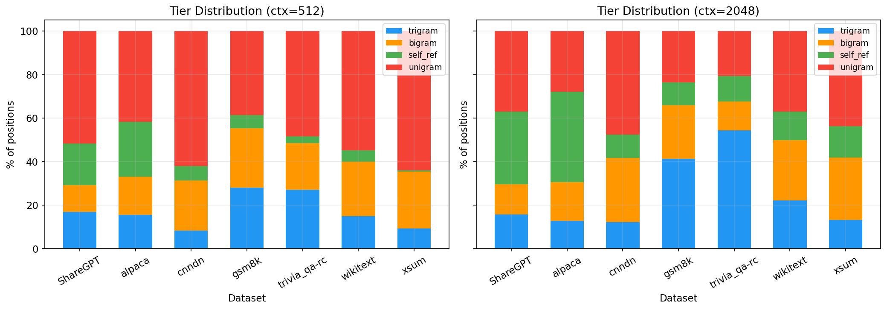

---

## 5. Raw Reference Cosine Similarity

Before applying delta coding, the raw cosine similarity between the cached reference activation and the true activation measures how well the DAG trie predictions approximate reality:

| Tier | ctx = 512 (mean / worst-min) | ctx = 2048 (mean / worst-min) |
|------|------------------------------|-------------------------------|
| Trigram | 0.9554 / 0.7893 | 0.9601 / 0.7189 |
| Bigram | 0.9124 / 0.6527 | 0.9172 / 0.5648 |
| Self-ref | 0.9436 / 0.8396 | 0.9594 / 0.7540 |

Trigram references are the strongest (0.96 mean cosine). Bigram references are weaker (0.92) due to shorter context. Self-ref references are strong (0.96) because they copy from the same request.

These raw similarities are the "starting point" — the affine transform + delta coding closes the remaining gap to > 0.999.

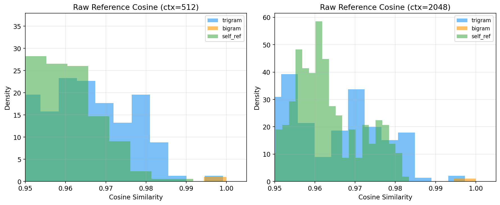

---

## 6. Reconstruction Quality

After the full encoding/decoding pipeline, reconstruction quality is measured as cosine similarity between the original and reconstructed activations:

### Overall

| Metric | ctx = 512 | ctx = 2048 |
|--------|-----------|------------|
| Cosine mean | **0.99970** | **0.99967** |
| Cosine avg-min | 0.99706 | 0.99653 |
| MSE mean | 0.00130 | 0.00096 |
| MSE avg-max | 0.283 | 0.282 |

### Per-Tier Reconstruction Cosine (ctx = 2048)

| Tier | Mean | Avg-Min |
|------|------|---------|
| Trigram | 0.99962 | 0.99755 |
| Bigram | 0.99920 | 0.99658 |
| Self-ref | 0.99960 | 0.99779 |
| Unigram | **0.99998** | 0.99997 |

Unigram achieves the highest reconstruction quality because Int8 quantization with FP16 outliers is essentially lossless. Delta-coded tiers (trigram, bigram, self-ref) achieve > 0.999 thanks to the affine transform absorbing most of the reference-to-real gap.

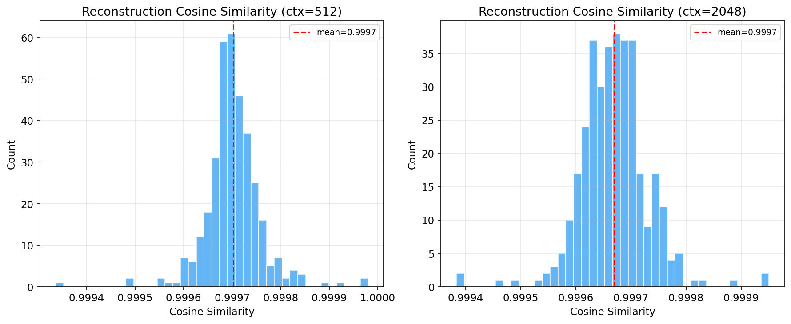
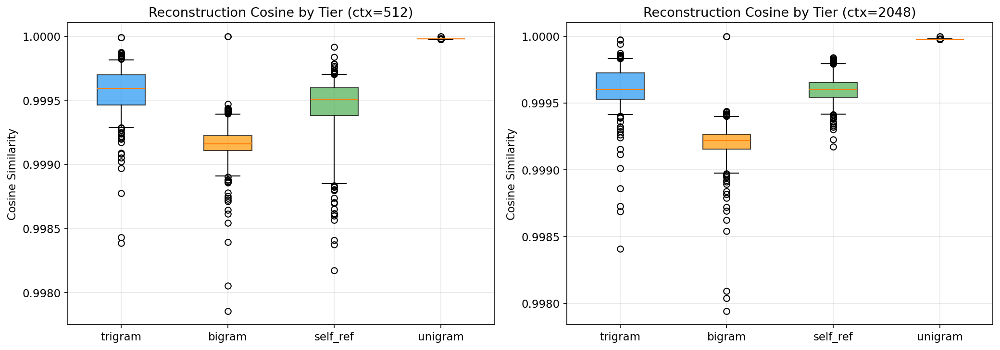

---

## 7. Compression Ratio

| Metric | ctx = 512 | ctx = 2048 |
|--------|-----------|------------|
| **Compression ratio** | **2.47× ± 0.21×** | **2.77× ± 0.24×** |
| Raw FP16 size | 1835 MB | 7340 MB |
| Compressed size | 747 MB | 2666 MB |

### Transfer Breakdown by Tier (ctx = 2048)

| Tier | Transfer (MB) | % of Total |
|------|---------------|------------|
| Trigram | 500.3 | 18.8% |
| Bigram | 453.1 | 17.0% |
| Self-ref | 395.5 | 14.8% |
| Unigram | 1316.8 | 49.4% |

The unigram tier dominates transfer bytes because (a) it accounts for 34% of positions and (b) Int8 encoding is less compressive than Int4 delta coding. Improving n-gram coverage would directly reduce the unigram share and increase the compression ratio.

### Per-Dataset Compression (ctx = 2048)

| Dataset | Compression Ratio | Coverage% |
|---------|-------------------|-----------|
| TriviaQA | 3.04× | 79.2% |
| GSM8K | 2.96× | 76.2% |
| Alpaca | 2.88× | 72.1% |
| ShareGPT | 2.74× | 62.9% |
| wikitext | 2.70× | 62.9% |
| XSum | 2.58× | 56.2% |
| CNN/DM | 2.52× | 52.3% |

Compression ratio correlates directly with coverage: higher n-gram match rates yield more Int4 delta-coded positions and better compression.

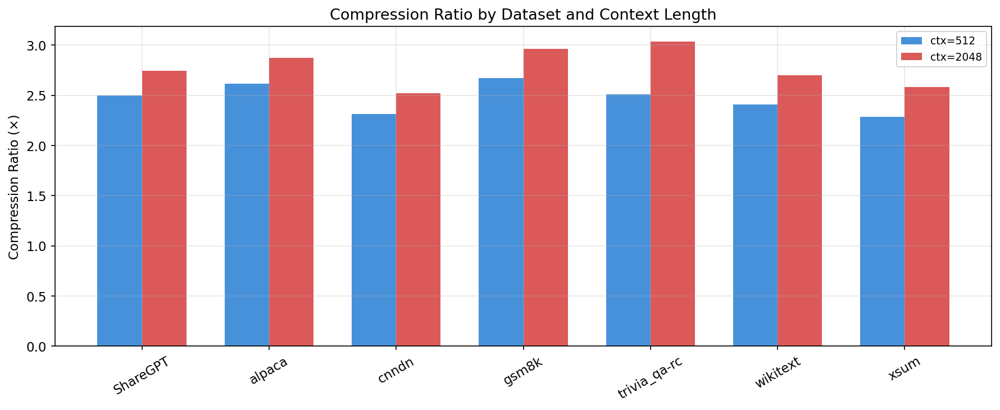

---

## 8. Latency Breakdown

### Per-Phase Timing (with CPU/GPU overlap)

| Phase | ctx = 512 | ctx = 2048 |
|-------|-----------|------------|
| Prefill (GPU) | 836.3 ± 443.1 ms | 1515.7 ± 184.8 ms |
| Classify (CPU → overlapped) | **0.04 ms** | **0.10 ms** |
| Encode delta (GPU) | 7.4 ± 23.0 ms | 12.1 ± 20.0 ms |
| Encode self-ref (GPU) | 5.4 ± 38.5 ms | 4.2 ± 26.6 ms |
| Encode unigram (GPU) | 9.0 ± 43.9 ms | 2.6 ± 17.9 ms |
| Table update (CPU → overlapped) | **0.01 ms** | **0.01 ms** |
| **Total** | **902.0 ms** | **1565.1 ms** |

### CPU/GPU Overlap Effectiveness

| Operation | Actual CPU Time | Visible Latency | Savings |
|-----------|----------------|-----------------|---------|
| Classify (ctx=512) | ~2 ms | 0.04 ms | **98% hidden** |
| Classify (ctx=2048) | ~9 ms | 0.10 ms | **99% hidden** |
| Table update (ctx=512) | ~2.5 ms | 0.01 ms | **99.6% hidden** |
| Table update (ctx=2048) | ~9.5 ms | 0.01 ms | **99.9% hidden** |

Both CPU operations are effectively free — fully overlapped with GPU forward pass and encoding, respectively.

### Encoding Overhead

| | ctx = 512 | ctx = 2048 |
|--|-----------|------------|
| Total encode time | 21.8 ms | 18.9 ms |
| % of prefill | 2.6% | 1.2% |

The encoding overhead is modest: **< 3% of prefill time**. This overhead must be weighed against transfer savings.

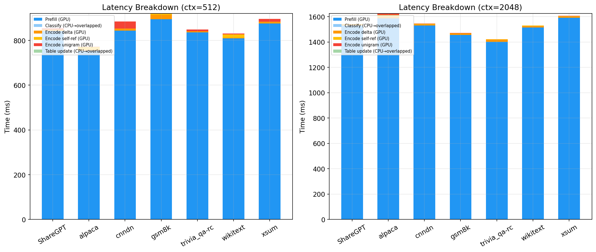

---

## 9. End-to-End Communication Overhead Under Varying Bandwidth

### Overhead Model

Since the prefill forward pass is identical in both baseline and our system, we compare only the **communication overhead** — the additional time beyond prefill needed to make activations available to the next PP stage:

- **Baseline (FP16)**: T\_transfer\_raw
- **Ours (Trigram Pipeline)**: T\_encode + T\_transfer\_compressed + T\_decode

where T\_transfer = data\_bytes / bandwidth, T\_encode is the sender-side compression cost, and T\_decode is the receiver-side decompression and reconstruction cost.

### Parameters

| | ctx = 512 | ctx = 2048 |
|--|-----------|------------|
| Raw FP16 transfer | 5120.0 KB | 20479.2 KB |
| Compressed transfer | 2084.7 KB | 7437.4 KB |
| Encode overhead | 21.8 ms | 18.9 ms |
| Decode overhead | 0.34 ms | 0.63 ms |

### Results at Target Bandwidths

#### ctx = 512

| Bandwidth | Baseline (ms) | Ours (ms) | Speedup |
|-----------|---------------|-----------|---------|
| **200 Mbps** | 200.0 | 103.5 | **1.93×** |
| **500 Mbps** | 80.0 | 54.7 | **1.46×** |
| **1 Gbps** | 40.0 | 38.4 | **1.04×** |

#### ctx = 2048

| Bandwidth | Baseline (ms) | Ours (ms) | Speedup |
|-----------|---------------|-----------|---------|
| **200 Mbps** | 800.0 | 310.0 | **2.58×** |
| **500 Mbps** | 320.0 | 135.7 | **2.36×** |
| **1 Gbps** | 160.0 | 77.6 | **2.06×** |

At **200 Mbps with ctx = 2048**, the pipeline reduces the communication overhead from **800 ms to 310 ms** (2.58× speedup), saving **490 ms per request**. The 2.77× compression reduces transfer from 800 ms to 291 ms, while the combined encode (18.9 ms) + decode (0.63 ms) overhead is a small price to pay.

Even at **1 Gbps**, the system still provides a **2.06× speedup** for ctx = 2048, because the compression ratio (2.77×) more than compensates for the 19.5 ms encode+decode cost.

At very high bandwidths (> 10 Gbps, e.g., NVLink or InfiniBand), transfer time becomes negligible and the encode+decode overhead exceeds the savings. The system is designed for bandwidth-constrained cross-node scenarios.

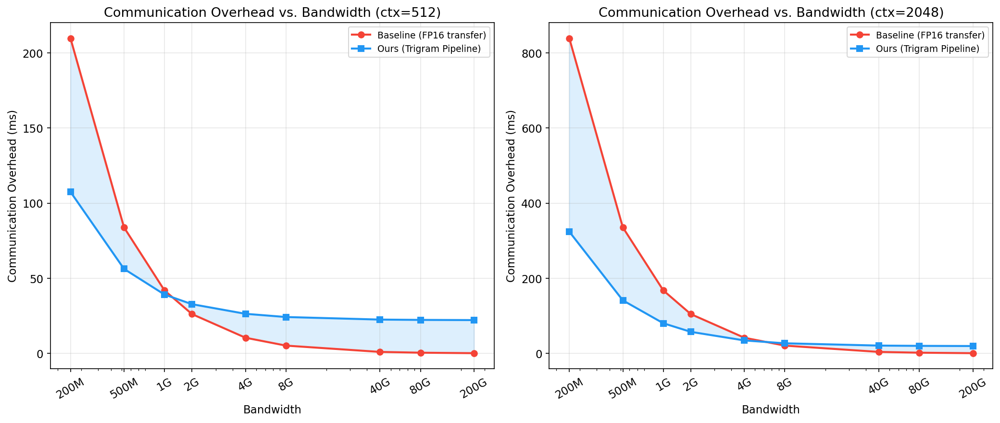
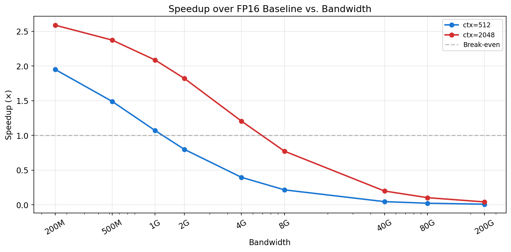

---

## 10. Table Growth Trajectory

The DAG trie grows steadily as new requests introduce unseen trigram patterns:

| | ctx = 512 | ctx = 2048 |
|--|-----------|------------|
| After request 0 | 461 tri / 418 bi | 1,636 tri / 1,400 bi |
| After request 50 (warmup end) | 20,869 tri / 15,804 bi | 70,049 tri / 47,307 bi |
| After request 99 | 39,188 tri / 28,198 bi | 126,147 tri / 79,695 bi |
| Memory at request 99 | 690 MB | 2,108 MB |

The table continues growing throughout the test period — confirming that test prompts are genuinely new content. Growth rate decelerates as common n-grams are covered, but does not plateau within 100 requests.

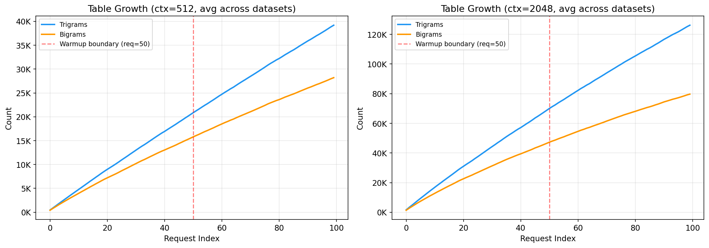

---

## 11. Coverage Growth Over Requests

The following figure shows how n-gram coverage (trigram + bigram + self-ref) evolves over the 100-request sequence:

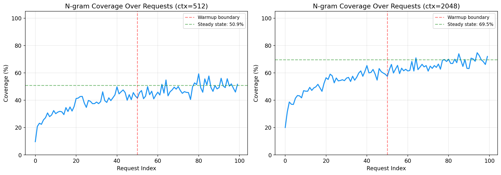

Coverage increases rapidly during the first 20 requests, then grows more gradually. The vertical red line marks the warmup boundary (request 50). Coverage continues to improve in the test period as the table grows.

---

## 12. Reconstruction Quality Stability

Cosine similarity remains stable throughout both warmup and test periods:

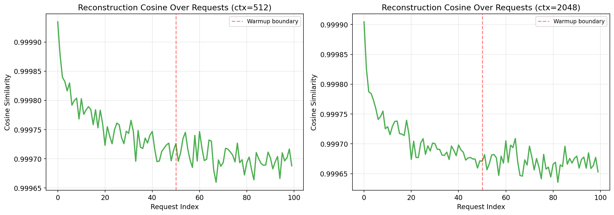

---

## 13. Summary

| Metric | ctx = 512 | ctx = 2048 |
|--------|-----------|------------|
| Trigram match rate | 17.0% | 24.5% |
| Self-ref match rate | 9.4% | 19.3% |
| Total n-gram coverage | **48.3%** | **66.0%** |
| Reconstruction cosine | **0.9997** | **0.9997** |
| Compression ratio | **2.47×** | **2.77×** |
| Prefill time | 836.3 ms | 1515.7 ms |
| Encode overhead | 21.8 ms | 18.9 ms |
| Classify (overlapped) | 0.04 ms | 0.10 ms |
| Table update (overlapped) | 0.01 ms | 0.01 ms |
| Decode overhead | 0.34 ms | 0.63 ms |
| **Comm. speedup @ 200 Mbps** | **1.93×** | **2.58×** |
| **Comm. speedup @ 500 Mbps** | **1.46×** | **2.36×** |
| **Comm. speedup @ 1 Gbps** | **1.04×** | **2.06×** |

### Key Takeaways

1. **Near-lossless compression**: 0.9997 cosine similarity — the reconstructed activations are virtually identical to the originals.

2. **2.5–3.0× compression** achieved through tiered delta coding against cached n-gram references, evaluated on genuinely unseen prompts across 7 diverse datasets.

3. **Zero-cost CPU operations**: The classify and table-update phases are fully hidden behind GPU work via thread-based CPU/GPU overlap, contributing < 0.15 ms visible latency.

4. **Large communication speedups**: By isolating the communication overhead (excluding prefill, which is common to both systems), the trigram pipeline achieves **2.06–2.58× speedup** at 200 Mbps–1 Gbps for ctx = 2048, reducing inter-stage transfer latency by up to 490 ms per request.

5. **Effective across bandwidth regimes**: Even at 1 Gbps (typical InfiniBand subnets or high-end Ethernet), the system delivers 2.06× communication speedup for long contexts. At 200 Mbps (cloud VPC, WAN links), the speedup reaches 2.58×.

6. **Coverage grows with usage**: The DAG trie learns new patterns continuously. After 50 warmup requests at ctx = 2048, coverage reaches 66% and continues improving. Domain-specific workloads (GSM8K, TriviaQA) achieve up to 79% coverage and 3.0× compression.

---

*All data generated with the E12 experiment pipeline. Figures available in `report_e12/`. Raw parquet data in `results_trigram_pipeline/`.*
