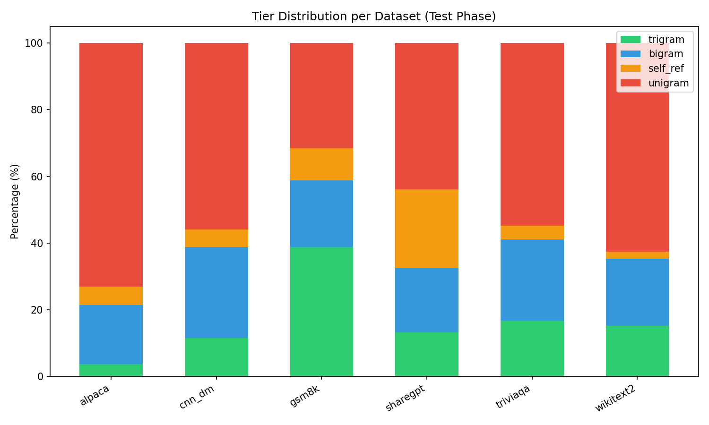
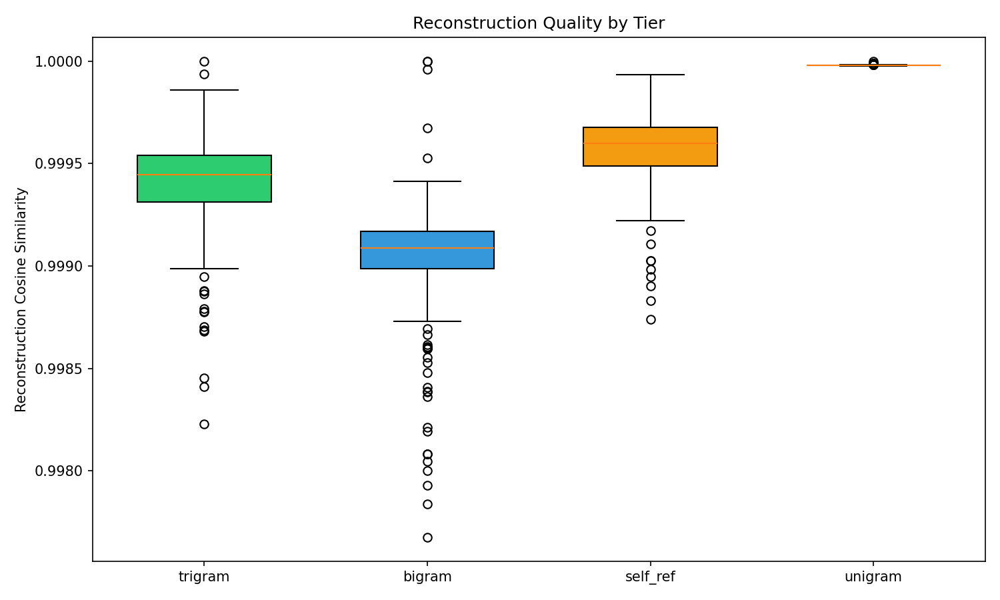
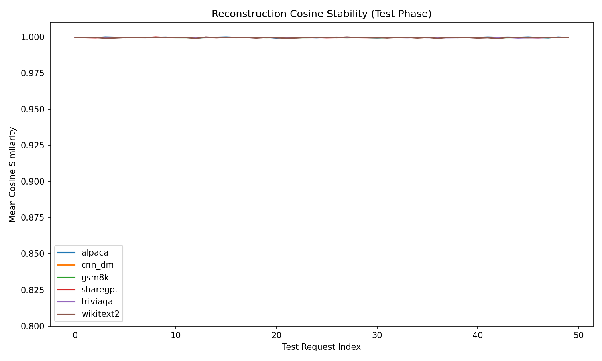
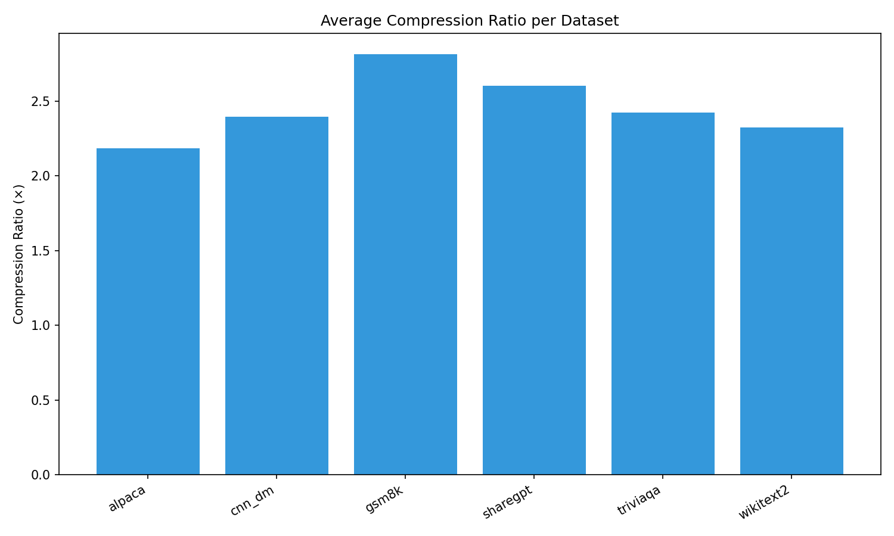
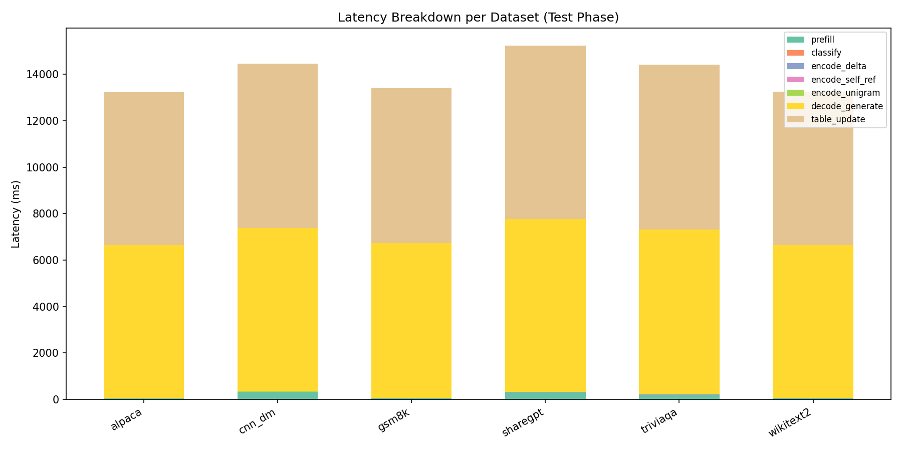
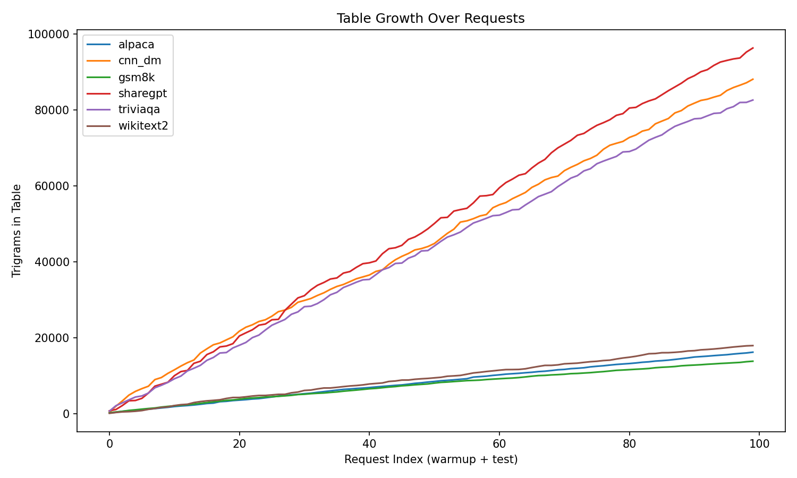
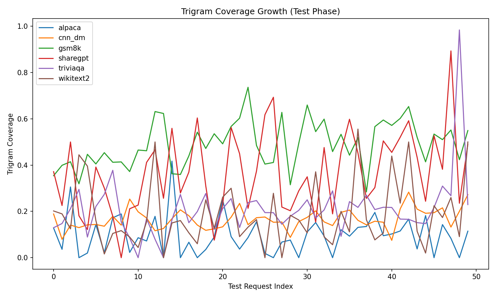
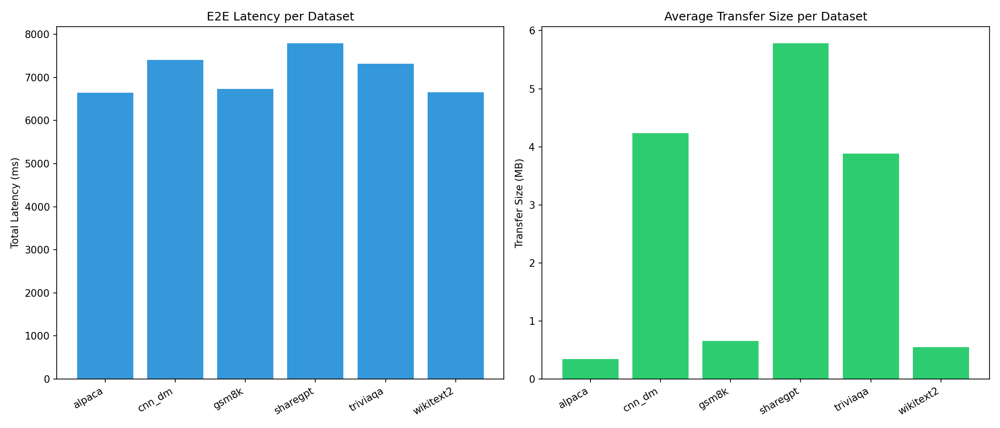
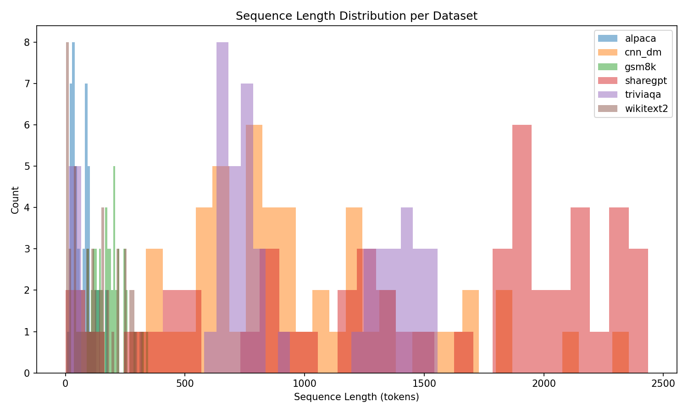

# E12v2 实验报告: 自然长度 Trigram 流水线 + 解码阶段

## 1. 实验概述

本实验（E12v2）使用 6 个数据集的原始文本长度运行 trigram delta-coding 流水线。
相比 E12，E12v2 的改进：
- 文本保持自然长度（无拼接/截断）
- 独立的预热阶段和测试阶段
- 包含 128 token 解码（生成）阶段
- 每个数据集 100 个预热 + 100 个测试请求

## 2. 数据集与序列长度统计

| 数据集 | 测试请求数 | 平均序列长度 | 中位序列长度 | 最短 | 最长 |
|--------|-----------|-------------|-------------|------|------|
| alpaca | 50 | 74 | 61 | 7 | 325 |
| cnn_dm | 50 | 991 | 884 | 267 | 2356 |
| gsm8k | 50 | 180 | 178 | 89 | 345 |
| sharegpt | 50 | 1478 | 1734 | 1 | 2436 |
| triviaqa | 50 | 920 | 758 | 14 | 1556 |
| wikitext2 | 50 | 123 | 112 | 3 | 320 |

## 3. Tier 分布

| 数据集 | Trigram% | Bigram% | Self-ref% | Unigram% |
|--------|---------|---------|-----------|----------|
| alpaca | 3.8 | 17.6 | 5.6 | 73.0 |
| cnn_dm | 11.5 | 27.4 | 5.2 | 56.0 |
| gsm8k | 38.8 | 20.0 | 9.7 | 31.5 |
| sharegpt | 13.1 | 19.4 | 23.5 | 43.9 |
| triviaqa | 16.7 | 24.4 | 4.1 | 54.8 |
| wikitext2 | 15.1 | 20.1 | 2.2 | 62.5 |

## 4. 重建质量

| 数据集 | Cosine Mean | Cosine Min | MSE Mean | 压缩比 |
|--------|------------|------------|----------|--------|
| alpaca | 0.9998 | 0.9979 | 0.007036 | 2.18× |
| cnn_dm | 0.9997 | 0.9964 | 0.001141 | 2.40× |
| gsm8k | 0.9996 | 0.9978 | 0.002641 | 2.81× |
| sharegpt | 0.9997 | 0.9967 | 0.006763 | 2.60× |
| triviaqa | 0.9996 | 0.9967 | 0.002552 | 2.42× |
| wikitext2 | 0.9996 | 0.9971 | 0.008497 | 2.32× |

## 5. 压缩效率

## 6. 延迟分析

| 数据集 | Prefill(ms) | Classify(ms) | Encode(ms) | Decode(ms) | Total(ms) |
|--------|------------|-------------|------------|------------|-----------|
| alpaca | 50.5 | 0.0 | 4.4 | 6584.3 | 6643.2 |
| cnn_dm | 332.2 | 0.0 | 5.1 | 7049.5 | 7410.8 |
| gsm8k | 55.5 | 0.0 | 2.4 | 6674.2 | 6736.8 |
| sharegpt | 311.2 | 0.0 | 4.8 | 7451.6 | 7789.6 |
| triviaqa | 205.7 | 0.0 | 4.8 | 7100.2 | 7323.3 |
| wikitext2 | 54.2 | 0.0 | 4.3 | 6597.8 | 6661.0 |

## 7. Table 增长

## 8. 带宽对比

## 9. 序列长度分布

